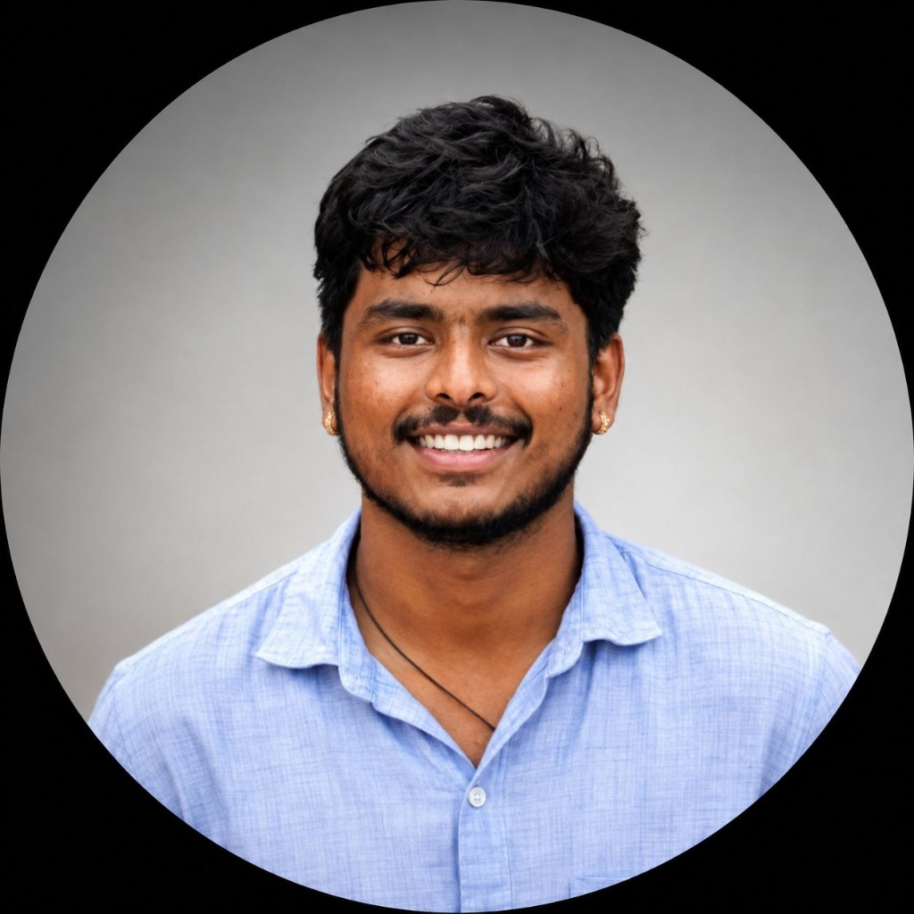

# Vaibhav R Valakunde — Creative Developer Portfolio ✦

A premium, interactive 3D portfolio showcasing engineering, data analytics, and AI projects. Built with a focus on immersive experiences, cinematic transitions, and high-performance WebGL animations.

## 🚀 Features

- **Interactive 3D Environments:** Custom WebGL scenes built with React Three Fiber.
- **Project Visualizations:** Full-screen immersive 3D backgrounds for every project (AURA AI, SAREGAMA, RAKSHAK AI).
- **Cinematic Animations:** Smooth scroll interpolation (Lenis), scroll-linked parallax, and frame-perfect reveals (Framer Motion).
- **Dynamic Gradient Mesh:** A reactive, pulsing background that breathes with user interaction.
- **Modern Tech Stack:** Next.js 16 (App Router), Tailwind CSS, TypeScript.

## 🛠️ Tech Stack

| Category | Technologies |
|---|---|
| **Core** | Next.js 16, React, TypeScript |
| **Styling** | Tailwind CSS |
| **Animations** | Framer Motion, Lenis (Smooth Scroll) |
| **3D & WebGL** | React Three Fiber, Three.js, Drei |

## 💻 Live Demo

Click here to watch my portfolio in action:  
👉 **[https://portfolio-17i2.onrender.com](https://portfolio-17i2.onrender.com)**

## 📱 Projects Featured

- **AURA AI:** Advanced voice waveform modeling.
- **SAREGAMA:** Real-time music equalizer visualizations.
- **RAKSHAK AI:** Defensive shielding mechanisms and security intelligence.

## 📬 Connect

- **GitHub:** [@vaibhavrvalakunde2006-gif](https://github.com/vaibhavrvalakunde2006-gif)
- **LinkedIn:** [Vaibhav R Valakunde](https://www.linkedin.com/in/vaibhav-r-valakunde-596a08398)

---
*BUILD. BREAK. FIX. REPEAT.*
